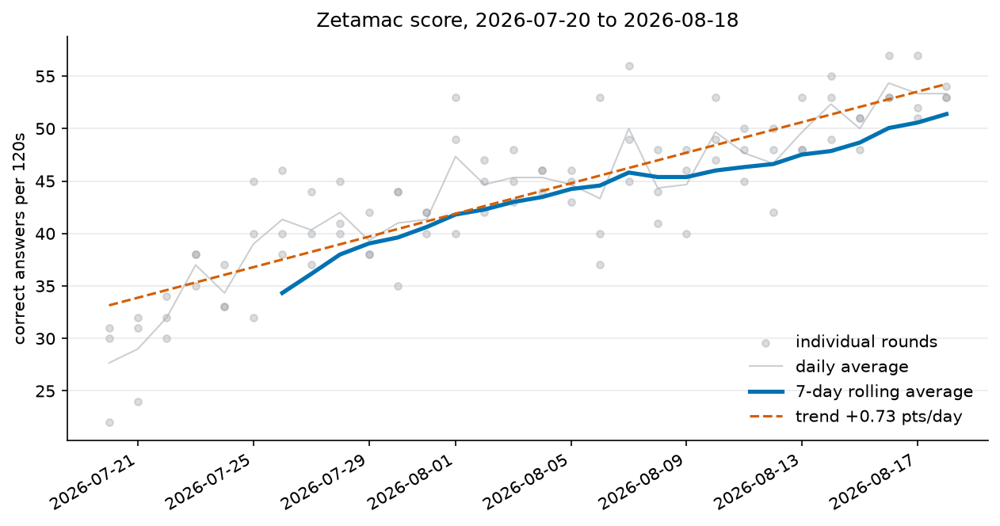

# 15 — Zetamac Progress Analysis (Pandas)

Analysing a month of my real Zetamac practice with Pandas: is my score actually
trending up, and does performance change across the three rounds I play each day?

First project on real data I collected myself rather than data I generated.

## Data

`data/quant_prep_daily_log.csv` — my hand-kept daily tracker, committed raw and
unmodified. It's a spreadsheet export, so it's shaped for a human, not a program:
three `Round N` columns side by side, decimal commas in the derived columns,
pre-filled future dates with no scores, and several tracking columns unrelated to
Zetamac.

`tidy.py` turns it into `data/sessions.csv` — one row per attempt, three columns:

```
date,round,score
2026-07-20,1,22
2026-07-20,2,30
```

**90 attempts across 30 days**, 2026-07-20 to 2026-08-18. Everything downstream
reads the tidy file and never touches the raw one.

## Running it

```bash
python tidy.py        # raw log -> data/sessions.csv
python load.py        # dtypes, describe, sanity checks
python analyze.py     # daily averages, rolling mean, trend, records
python breakdowns.py  # round-order and weekday effects
python plot.py        # -> progress.png
```

## Findings



| Metric | Value |
|---|---|
| Sessions analysed | 90 rounds over 30 days |
| First week average | 34.33 |
| Last week average | 51.38 |
| Improvement | +17.05 points (+49.7%) |
| Linear trend | +0.73 points/day |
| Best single round | 57 (2026-08-16) |
| Best day average | 54.33 (2026-08-16) |
| Round 1 / 2 / 3 means | 44.43 / 43.60 / 43.07 |
| Round effect, detrended | +0.73 / −0.10 / −0.63 |

The improvement is real and large — roughly half again my starting score in a
month, which is about 2.3 standard deviations of the daily spread.

The **round effect** needed detrending to mean anything. Raw round means are
contaminated by the upward trend, so I measured each attempt against its own
day's average using `groupby("date")["score"].transform("mean")`. Within a day,
round 3 sits about 1.4 points below round 1 — a fatigue effect, not a warm-up
effect.

## Caveats

Both breakdowns are weaker than they look, and saying so is the point:

- **The weekday result is noise.** Wednesday averages 40.67 and Sunday 46.25, but
  each weekday has only 4–5 observations against a daily standard deviation near
  7.5. That's a standard error around 3.5 points, so a 5.6-point spread is well
  inside the error bars. There is no Wednesday effect; there's a small sample.
- **The round effect is suggestive, not established.** Pairing within days removes
  the trend, which is the right fix, but 1.4 points against a per-day spread near
  3 across 30 days is about 1.5 standard errors.
- **The linear fit is descriptive, not predictive.** +0.73/day extrapolates to 60
  by mid-September and 70 by late October, which won't happen — arithmetic speed
  plateaus once typing fluency and common products stop being the bottleneck. The
  rolling line is already flattening against the trend line in the chart. My own
  tracker notes say week one was partly a laptop-typing handicap, so some of the
  early gain isn't arithmetic at all.

## Concepts

`pd.read_csv` (`usecols`, `parse_dates`) · `melt` (wide → long) · `dropna` ·
`astype` · `.str` accessor · `.assign` · `groupby` with named aggregation ·
`.transform` · `rolling` · `.dt` accessor · `pivot` · `reindex` · `idxmax` /
`nlargest` · `np.polyfit` · matplotlib `fig`/`ax`, `savefig`